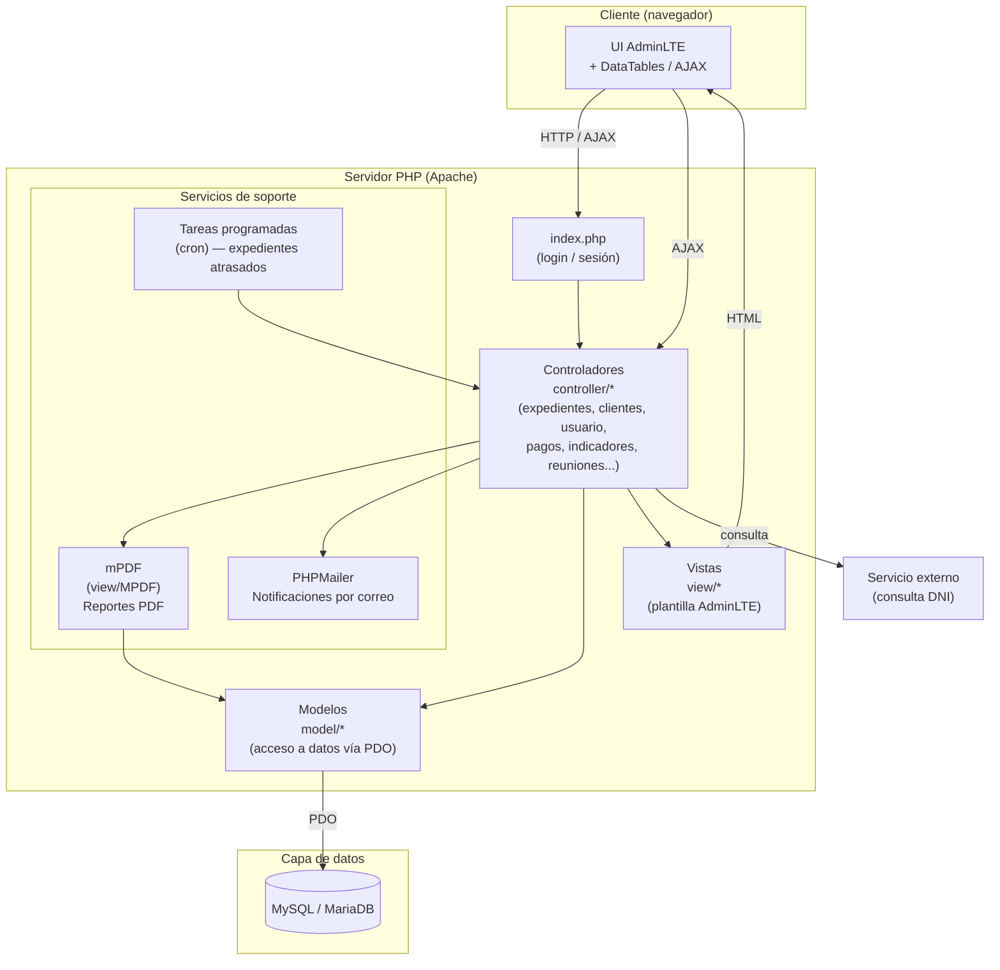

# INCOCAT — Sistema de Gestión Documentaria y Trámites

Sistema web de administración interna para el seguimiento de **clientes, expedientes, trámites, pagos, ingresos/gastos, indicadores y reuniones**, construido a la medida para digitalizar un flujo de trabajo que antes se gestionaba en papel y hojas de cálculo.

> Proyecto desarrollado de forma integral: análisis, base de datos, backend, frontend y despliegue.

---

## Descripción

INCOCAT centraliza la operación diaria de una empresa de gestoría/tramitología, permitiendo registrar clientes, abrir y dar seguimiento a expedientes por distrito/provincia/región, controlar pagos e ingresos, generar reportes en PDF y notificar automáticamente expedientes atrasados, todo bajo un esquema de roles (administrador, secretaria, etc.) con permisos diferenciados por vista.

## Características principales

- **Gestión de expedientes**: registro, edición, búsqueda, filtros por fecha/estado/distrito/provincia, historial de cambios y archivado.
- **Gestión de clientes**: alta, edición y consulta de datos vinculados a expedientes.
- **Ubigeo dinámico**: dependencias en cascada entre regiones, provincias y distritos.
- **Consulta de DNI por AJAX**: autocompletado de datos de clientes desde un servicio externo.
- **Usuarios y roles**: sesiones, control de acceso por rol (administrador / secretaria), gestión de áreas y empleados.
- **Indicadores de gestión**: paneles con totales de expedientes (en trámite, en proceso, observados, finalizados), clientes, reuniones, ingresos y gastos.
- **Pagos, ingresos y gastos**: registro y control financiero asociado a cada expediente.
- **Reportes en PDF**: generación de documentos con mPDF.
- **Notificaciones automáticas**: tareas programadas (cron) para alertar expedientes atrasados y comunicados.
- **Envío de correos**: integración con PHPMailer para notificaciones por email.
- **Tablas interactivas**: listados con DataTables (búsqueda, orden y paginado en el cliente).

## Impacto y mejoras (estimado)

Resultados aproximados al pasar de un proceso manual/físico a este sistema digital:

| Indicador | Mejora estimada |
| --- | :---: |
| Tiempo de búsqueda y consulta de un expediente | ↓ ~70% |
| Tiempo de registro de un nuevo cliente/expediente | ↓ ~50% |
| Errores de digitación en el seguimiento de trámites | ↓ ~60% |
| Expedientes atrasados sin detectar a tiempo | ↓ ~80% |
| Tiempo de generación de reportes (manual vs. PDF automático) | ↓ ~90% |

*Cifras estimadas según la naturaleza del proceso digitalizado (eliminación de registros físicos, búsquedas manuales y reportes hechos a mano).*

## Arquitectura

El proyecto sigue una organización **MVC** simple sobre PHP plano, con un cliente web que consume controladores vía peticiones HTTP/AJAX, los cuales orquestan el acceso a datos a través de los modelos y delegan la generación de vistas, PDFs y notificaciones a sus respectivas capas.



### Estructura de carpetas

```text
incocat_abancay/
├── controller/      # Lógica de negocio por módulo (expedientes, clientes, usuario, pagos, etc.)
├── model/           # Acceso a datos (PDO) por entidad
├── view/            # Vistas PHP/HTML por módulo + generación de PDF (MPDF)
├── plantilla/       # Tema AdminLTE y librerías (DataTables, CodeMirror, FontAwesome, etc.)
├── utilitario/      # Utilidades compartidas (DataTables)
├── PHPMailer-master/# Librería de envío de correos
├── img/ Fotos/      # Recursos estáticos
└── index.php        # Punto de entrada / login
```

## Tecnologías utilizadas

- **Backend:** PHP (PDO / MySQLi)
- **Base de datos:** MySQL / MariaDB
- **Frontend:** HTML5, CSS3, JavaScript, AdminLTE (Bootstrap)
- **Librerías:** PHPMailer, mPDF, DataTables, Font Awesome
- **Gestión de dependencias:** Composer
- **Control de versiones:** Git

## Instalación y configuración

1. Clonar el repositorio dentro del directorio de tu servidor local (XAMPP, WAMP, etc.).
2. Instalar dependencias con Composer:

   ```bash
   composer install
   ```

3. Crear la base de datos en MySQL/MariaDB e importar el esquema correspondiente.
4. Copiar los archivos de ejemplo y completarlos con tus propias credenciales (host, usuario, contraseña y nombre de base de datos):

   ```bash
   cp model/model_conexion.example.php model/model_conexion.php
   cp view/MPDF/conexion.example.php view/MPDF/conexion.php
   ```

5. Levantar el servidor (Apache vía XAMPP) y acceder a `index.php`.

> Por seguridad, los archivos reales de conexión (`model/model_conexion.php` y `view/MPDF/conexion.php`) están excluidos del repositorio mediante `.gitignore`. Solo se versionan sus respectivas plantillas `*.example.php` con valores de ejemplo.

## Roles de usuario

- **Administrador:** acceso completo a todos los módulos, indicadores y reportes.
- **Secretaria:** acceso operativo a expedientes y clientes con vistas restringidas según permisos.

## Estado del proyecto

En mantenimiento activo, con mejoras continuas sobre el módulo de expedientes y roles de usuario.

---

## Autor

Jersson Jorge Corilla Miranda

## Licencia y derechos de autor

© 2026 Jersson Jorge Corilla Miranda. Todos los derechos reservados.

Este proyecto y su código fuente son propiedad del autor y se muestran con fines de portafolio profesional. Queda prohibida su reproducción, distribución o uso comercial sin autorización expresa del autor.
